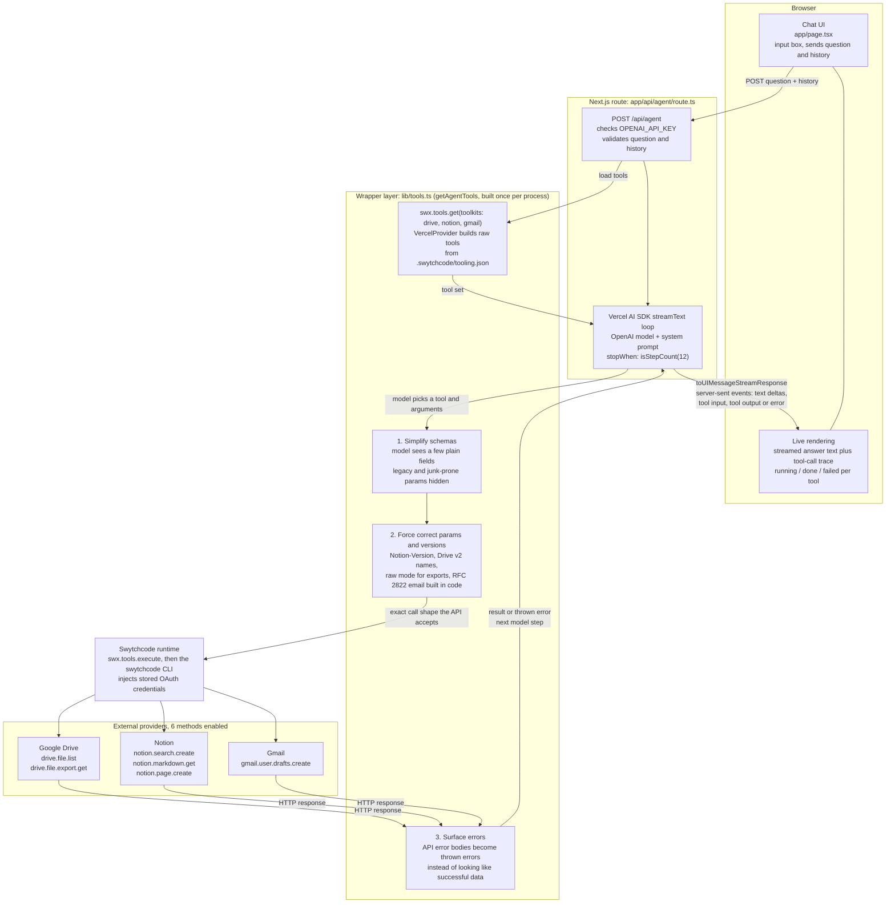

# Architecture

How a question travels through the Cross-Source Research Briefing Agent, from the chat box to Google Drive, Notion and Gmail and back. This reflects the code as implemented, including the `lib/tools.ts` wrapper layer.

## What happens on a request

1. The chat UI posts the question, plus prior turns as plain-text history, to `/api/agent`. The route fails fast with a clear message if `OPENAI_API_KEY` is missing.
2. `streamText` runs a tool loop (capped at 12 steps). The system prompt tells the model to route between Drive and Notion, search first, then read the best matches instead of trusting titles, synthesize a cited answer, and only create a Notion page or Gmail draft when explicitly asked.
3. Each tool call goes through the wrapper layer to Swytchcode, which runs the method against the provider using credentials the developer connected once with `swytchcode auth connect`. The app never handles provider tokens.
4. Tool calls are streamed to the browser as they happen, so the UI can show each step (for example "Searching Google Drive...") before the final answer arrives.

## Why the wrapper layer exists

Swytchcode generates a tool for each method straight from the provider's API schema, and that raw schema turned out to be a poor interface for a language model: it exposes every optional or legacy field, and some of the values the API needs cannot be expressed through it at all. `lib/tools.ts` sits between the model and the raw methods so that the model only sees a small, safe set of inputs, while the code fills in everything the API is picky about. Each wrapper exists because of a real failure found by calling the live APIs, not guesswork. And because the CLI reports upstream HTTP failures as successful executions, a final layer turns them into real errors, so failures show up in the trace and the model can tell the user what went wrong instead of reasoning over an error body.

| Tool | Real problem found | What the wrapper does |
|---|---|---|
| `drive_file_list` | Schema exposes about 16 params. The model sent the legacy `corpus: "user"`, which Google rejects (400). The method is wired to Drive **v2**, so `pageSize`, `name contains` and `modifiedTime` are wrong or silently ignored. | Exposes only `q`, `pageSize`, `orderBy`, `fields`. Maps to v2 names (`maxResults`, `title`, `modifiedDate`), never sends `corpora`/`corpus`, and treats a bare-word `q` as a full-text search. |
| `drive_file_export_get` | The CLI's default JSON mode fails with "response is not valid JSON" on a plain-text document, even though Google returned it. | Uses raw mode, unwraps the body, caps it at 30,000 characters, and throws a clean error for PDFs and other non-Google files. |
| `notion_markdown_get` | `Notion-Version` is a required header, but the validator only accepts it when it is in both params and headers, and the runtime's flat-args path puts it in the body. No model-supplied arguments could ever pass. | Model supplies only `page_id`; the wrapper builds the params-plus-headers call itself. |
| `notion_search_create`, `notion_page_create` | The model sent stale `Notion-Version: 2022-06-28` (changing the response shape) and `start_cursor: "null"` (400). | Hides those fields from the schema and always sends the current default version. |
| `gmail_user_drafts_create` | The API needs a base64url-encoded RFC 2822 message in `raw`, which the model could not build (400 "Missing draft message"). | Model supplies `to`, `cc`, `subject`, `body` as plain text; code assembles and encodes the message, validates addresses (blocking header injection), strips markdown, and creates a draft (never sends). |
| All tools | Upstream 4xx/5xx responses come back as successful results with an error payload. | `throwOnApiError` converts them into thrown errors, shown as failures in the UI trace. |
