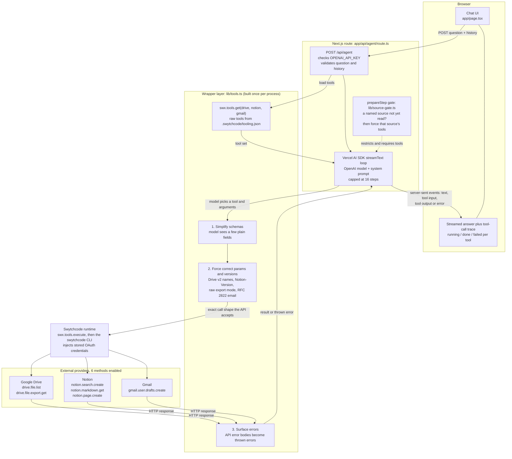

# Architecture

How a question travels from the chat box to Google Drive, Notion and Gmail and back, as implemented in the code.

## Request flow

1. The UI posts the question plus prior turns to `/api/agent`, which fails fast if `OPENAI_API_KEY` is missing.
2. `streamText` runs the tool loop. The system prompt tells the model to search, read the best matches (not just titles), synthesize a cited answer, and create a Notion page or Gmail draft only when explicitly asked.
3. Each tool call passes through the wrapper layer to Swytchcode, which runs it with credentials connected once via `swytchcode auth connect`. The app never handles provider tokens.
4. Tool calls stream to the browser as they happen, so the UI shows each step before the answer arrives.

## Why the wrapper layer exists

Swytchcode generates a tool per method straight from the provider's API schema. That raw schema is a poor interface for a language model: it exposes every optional and legacy field, and some values the API needs can't be expressed through it at all. `lib/tools.ts` gives the model a few plain inputs and fills in everything the API is picky about. Each wrapper exists because of a real failure found against the live APIs. The CLI also reports upstream HTTP errors as successful executions, so a final layer turns them into real errors that show in the trace.

| Tool | Real problem | What the wrapper does |
|---|---|---|
| `drive_file_list` | Schema exposes ~16 params; the model sent the legacy `corpus: "user"` (400). The method is wired to Drive **v2**, so `pageSize`, `name contains` and `modifiedTime` are wrong or ignored. | Exposes `q`, `pageSize`, `orderBy`, `fields`. Maps to v2 names, never sends `corpora`/`corpus`, treats a bare-word `q` as full-text search, and tells the model to retry when a search returns nothing. |
| `drive_file_export_get` | The CLI's JSON mode fails with "response is not valid JSON" on a plain-text document that Google returned fine. | Uses raw mode, caps output at 30,000 characters, throws a clean error for PDFs and other non-Google files. |
| `notion_markdown_get` | `Notion-Version` is a required header, but the validator only accepts it in both params and headers, and the runtime puts it in the body. No model-supplied arguments could pass. | Model supplies only `page_id`; the wrapper builds the params-plus-headers call. |
| `notion_search_create` | The model sent `filter.property: "title"` (400), `start_cursor: "null"` (400) and a stale `Notion-Version`. | Model supplies only `query` and `page_size`; the filter is locked to pages and the version pinned. |
| `notion_page_create` | The raw schema types `properties` as a string and `parent` as tangled `variant_*` objects, so no valid body could be built. | Model supplies `title`, `content` (light markdown) and optional `parent_page_id`; the wrapper builds the blocks and defaults to the workspace root. |
| `gmail_user_drafts_create` | The API needs a base64url RFC 2822 message in `raw`, which the model couldn't build (400 "Missing draft message"). | Model supplies `to`, `cc`, `subject`, `body`; code assembles and encodes it, validates addresses, strips markdown, and creates a draft (never sends). |
| All tools | Upstream 4xx/5xx responses come back as successful results. | `throwOnApiError` converts them to thrown errors, shown as failures in the trace. |

## Guardrails around the model

- **Read-before-answer gate** (`lib/source-gate.ts`). Prompting alone wasn't enough: the model sometimes ran one bad Drive search, never retried, and answered from Notion alone without saying so. While a source the question names has no successfully read document, the next step is restricted to that source's tools and a tool call is required. It releases after 3 empty or failed searches so a genuine "nothing found" still resolves honestly.
- **Agent-page tagging.** Pages the agent creates get an `[Agent] ` title prefix and are hidden from search, so its own summaries are never cited as independent source documentation.
